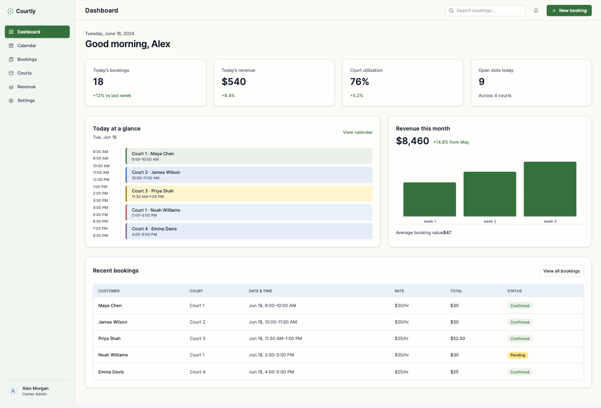
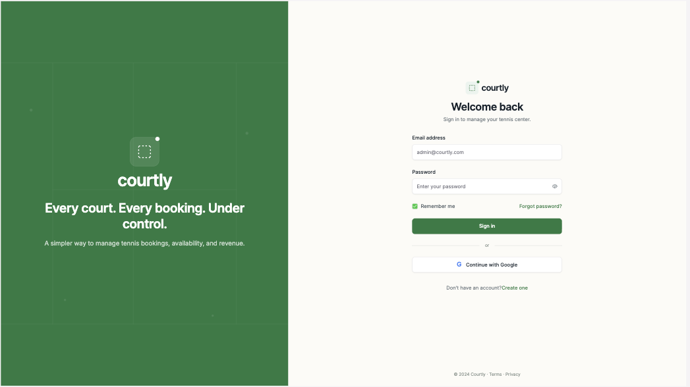
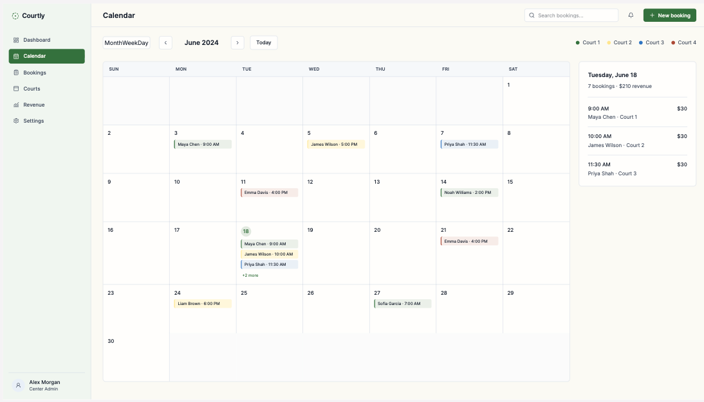
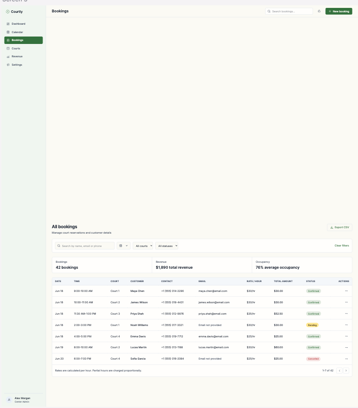
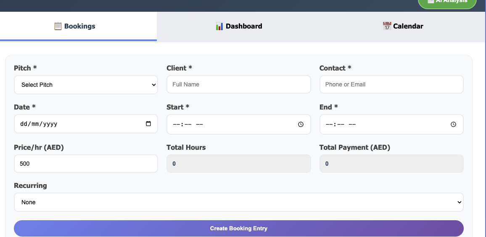
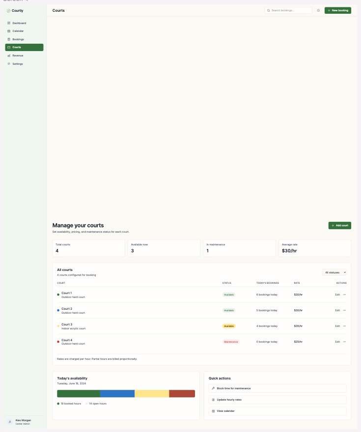
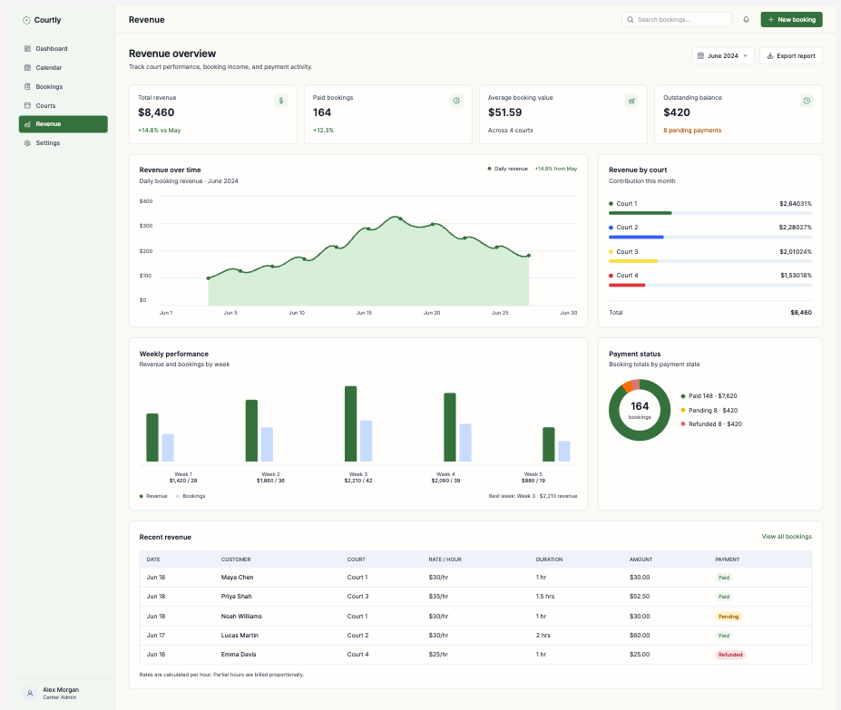

<p align="center">
  
</p>

<h1 align="center">Servly</h1>

<p align="center">
  <strong>Every court. Every booking. Under control.</strong><br />
  A simple, good-looking web app for managing tennis court bookings and tracking revenue.
</p>

<p align="center">
  
  
  
  
  
  
</p>

---

## About

Servly helps a sports center manager run their tennis courts day to day: take bookings, see what's happening today, avoid double-bookings, and know how much money is coming in. It runs entirely on Firebase's free plan, with no paid backend services.



## Features

- **Dashboard** — today's bookings, today's revenue, court utilization, open slots, a timeline of today's sessions, and this month's revenue at a glance.
- **Calendar** — month, week, and day views with bookings color-coded by court. Click an empty slot to book it.
- **Bookings** — search and filter all bookings by date, court, or status, change a booking's status, and export to CSV.
- **Courts** — add and edit courts, mark them as in maintenance, and see today's availability.
- **Revenue** — totals by day, week, month, and court.
- **Settings** — center details, timezone, and user management.
- **No double-booking** — overlapping bookings on the same court are blocked using Firestore transactions.
- **Per-booking rates** — each booking has its own hourly rate (for members, partners, and walk-ins). Partial hours are charged proportionally. All amounts are shown in **AED**.
- **Secure access** — email/password and Google sign-in. New accounts need admin approval before they can get in, and there are two roles: **admin** and **staff**.
- **Session timeout** — idle sessions sign out automatically, shared across browser tabs.
- **Welcome tour** — a short guided tour the first time a user signs in.

## Screenshots

| Sign in | Calendar |
|---|---|
|  |  |

| Bookings | New booking |
|---|---|
|  |  |

| Courts | Revenue |
|---|---|
|  |  |

## Tech stack

| Concern | Choice |
|---|---|
| Framework | React 18 + Vite + TypeScript |
| Styling | Tailwind CSS |
| Routing | React Router |
| Backend | Firebase Authentication + Cloud Firestore |
| Dates | date-fns + date-fns-tz |
| Charts | Recharts |
| Icons | lucide-react |
| Local development | Firebase Emulator Suite |
| Hosting | Firebase Hosting |

## Getting started

> Using this code requires written permission from the author. See [License](#license).

### Prerequisites

- [Node.js](https://nodejs.org/) 20 or newer
- A Firebase project (only needed for real data — practice mode works without one)

### 1. Install

```bash
git clone https://github.com/ayebaretony/servly.git
cd servly
npm install
```

### 2. Configure

Copy the example environment file:

```bash
cp .env.example .env.local
```

`.env.local` is git-ignored, so it is never committed.

### 3. Run

**Practice mode (no Firebase account needed).** Keep `VITE_USE_EMULATORS=true` in `.env.local`, then run these in two terminals:

```bash
npm run emulators
```

```bash
npm run dev
```

The app opens at `http://localhost:5173` and the Emulator UI at `http://localhost:4000`. Nothing real is touched.

**Real Firebase project.** Set `VITE_USE_EMULATORS=false` and fill in the `VITE_FIREBASE_*` values from the Firebase console (*Project settings → Your apps*), then run `npm run dev`.

### First admin

Signing up does not grant access. To create the first admin, sign up once, then in the Firebase console add a document at `users/{your-uid}` with `role: "admin"` and `active: true`. After that, admins can approve other users from **Settings**.

## Scripts

| Command | What it does |
|---|---|
| `npm run dev` | Start the development server |
| `npm run build` | Type-check and build for production into `dist/` |
| `npm run preview` | Preview the production build locally |
| `npm run lint` | Run ESLint |
| `npm run emulators` | Start the Firebase Auth + Firestore emulators |

## Deploying

```bash
npm run build
```

```bash
npx firebase deploy
```

This deploys the app to Firebase Hosting along with `firestore.rules` and `firestore.indexes.json`.

## Project structure

```
src/
  app/          # router, layout shell (sidebar + top bar), providers
  components/   # shared UI components
  features/     # auth, dashboard, calendar, bookings, courts, revenue, settings, tour
  lib/          # Firebase setup, money, time, and conflict helpers
  theme/        # design tokens
  types/        # shared TypeScript types
firestore.rules
firestore.indexes.json
firebase.json
```

## License

**Copyright © 2026 Tony Ayebare. All rights reserved.**

This source code is public for viewing only. You may **not** use, copy, modify, distribute, host, or build on any part of Servly — including its name, logo, and brand assets — without **written permission** from the author.

To ask for permission, reach out via [GitHub](https://github.com/ayebaretony). See [LICENSE](LICENSE) for the full terms.
